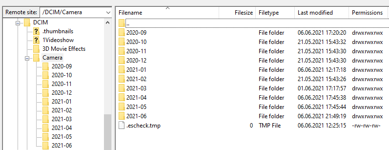

# Auto Organize /DCIM/Camera files into subfolders and download to local machine or server for a backup.

Before: thousands of photo files in /DCIM/Camera that are very hard to work with.

After:



## Usage:

1. Install SFTP server on Android phone(s). I use [this](https://play.google.com/store/apps/details?id=net.xnano.android.sshserver).

2. Configure one or more Android phones IP addresses and the folder for backups in the config.ts file. You may need to put some passwords into .env file or just type them as is.

> npm run main

## What happens?

1. The app connects to each Android phone one by one and moves the files from /DCIM/Camera to subfolders corresponding to the month the photo/video was taken. For example: /DCIM/Camera/2021-01.

2. It goes into each of the year-month folders and compares the files on the SFTP and on the destination. All files that are different or missing are added to the queue.

3. It processes the queue and downloads each file (if not exist already) to the destination specified in the config.ts file.

Done. No more manual processing with Filezilla.

## Example output

```
== /DCIM/Camera/2020-10 111 848 MB
=> //192.168.1.189/photo/Photos/2020/SlawaOnePlusNord/2020-10
== /DCIM/Camera/2020-11 55 10.6 GB
=> //192.168.1.189/photo/Photos/2020/SlawaOnePlusNord/2020-11
== /DCIM/Camera/2021-02 63 240 MB
=> //192.168.1.189/photo/Photos/2021/SlawaNord/2021-02
== /DCIM/Camera/2021-03 74 232 MB
=> //192.168.1.189/photo/Photos/2021/SlawaNord/2021-03
== /DCIM/Camera/2020-08 236 734 MB
=> //192.168.1.189/photo/Photos/2020/SlawaOnePlusNord/2020-08
== /DCIM/Camera/2020-09 228 1.38 GB
=> //192.168.1.189/photo/Photos/2020/SlawaOnePlusNord/2020-09
== /DCIM/Camera/2020-12 127 521 MB
=> //192.168.1.189/photo/Photos/2020/SlawaOnePlusNord/2020-12
== /DCIM/Camera/2021-01 140 1.23 GB
=> //192.168.1.189/photo/Photos/2021/SlawaNord/2021-01
== /DCIM/Camera/2021-05 229 1.27 GB
=> //192.168.1.189/photo/Photos/2021/SlawaNord/2021-05
440 2.07 MB IMG_20210523_151158.jpg
 ████████████████████████████████████████ 100% | ETA: 0s | 100/100
439 2.3 MB IMG_20210523_190147.jpg
 ████████████████████████████████████████ 100% | ETA: 0s | 100/100
438 2.31 MB IMG_20210523_193413.jpg
 ████████████████████████████████████████ 100% | ETA: 0s | 100/100
437 1.6 MB IMG_20210523_193418.jpg
 ████████████████████████████████████████ 100% | ETA: 0s | 100/100
436 2.46 MB IMG_20210523_193429.jpg
 ████████████████████████████████████████ 100% | ETA: 0s | 100/100/
```
